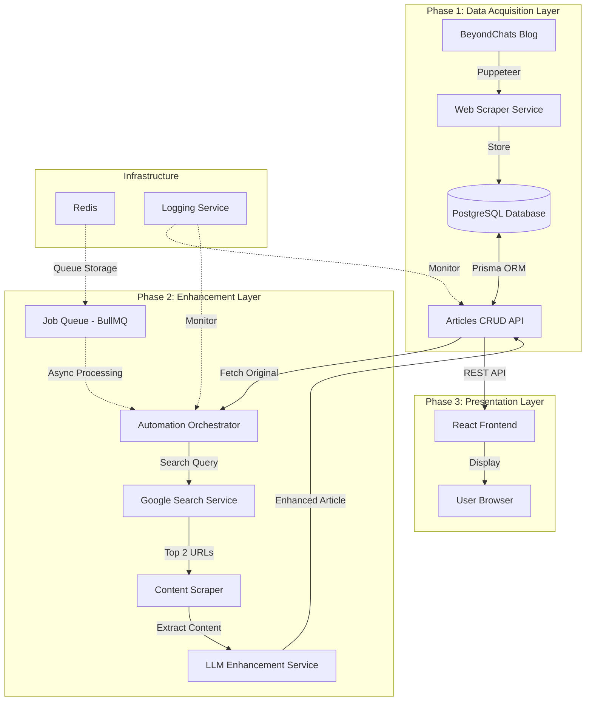

# BeyondChats Article Automation - System Architecture

> **Production-Grade Architecture Design**  
> Optimized for scalability, maintainability, and interview presentation

---

## 1. High-Level Architecture Overview

### System Components



### Architecture Layers

1. **Data Layer**: PostgreSQL + Prisma ORM
2. **Business Logic Layer**: NestJS services with dependency injection
3. **API Layer**: RESTful endpoints with OpenAPI documentation
4. **Async Processing Layer**: BullMQ job queue with Redis
5. **Presentation Layer**: React SPA with server state management

---

## 2. Tech Stack Selection & Justification

| Component | Technology | Justification | Interview Talking Points |
|-----------|-----------|---------------|--------------------------|
| **Backend Framework** | NestJS 11 + TypeScript | • Enterprise-grade architecture with built-in DI<br>• Decorator-based routing (similar to Spring Boot)<br>• Excellent for CRUD APIs<br>• Strong typing across the stack | "NestJS provides enterprise patterns out-of-the-box, making the codebase maintainable and testable. The modular architecture allows easy feature additions." |
| **Database** | PostgreSQL 16 | • ACID compliance for data integrity<br>• JSON support for flexible references field<br>• Excellent performance for read-heavy workloads<br>• Industry standard | "PostgreSQL ensures data consistency while providing flexibility with JSONB for storing article references." |
| **ORM** | Prisma | • Type-safe database queries<br>• Automatic migration generation<br>• Excellent developer experience<br>• Generated TypeScript types | "Prisma eliminates runtime errors with compile-time type checking and provides a clean migration workflow." |
| **Web Scraping** | Puppeteer + Cheerio | • Puppeteer handles dynamic JavaScript content<br>• Cheerio for fast static HTML parsing<br>• Stealth plugins to avoid bot detection | "Dual approach: Puppeteer for BeyondChats (may have JS), Cheerio for fast parsing of reference articles." |
| **Search Integration** | SerpAPI | • Reliable Google search results<br>• Structured JSON responses<br>• Rate limiting handled<br>• No proxy management needed | "SerpAPI provides production-ready search with proper rate limiting, avoiding the complexity of managing proxies." |
| **LLM Integration** | OpenAI GPT-4 / Anthropic Claude | • Industry-leading content generation<br>• Consistent API<br>• Good documentation<br>• Configurable parameters | "Abstracted LLM provider interface allows swapping between OpenAI and Anthropic without changing business logic." |
| **Job Queue** | BullMQ + Redis | • Reliable async processing<br>• Built-in retry logic<br>• Job monitoring and progress tracking<br>• Horizontal scaling ready | "BullMQ ensures article enhancement doesn't block API responses and provides automatic retry on failures." |
| **Frontend** | React 18 + TypeScript | • Component-based architecture<br>• Strong ecosystem<br>• Excellent performance<br>• Industry standard | "React with TypeScript ensures type safety across the entire application stack." |
| **Build Tool** | Vite | • Fast HMR (Hot Module Replacement)<br>• Optimized production builds<br>• Native ESM support | "Vite provides instant dev server startup and sub-second HMR, improving developer productivity." |
| **State Management** | TanStack Query | • Server state management<br>• Automatic caching and refetching<br>• Loading/error states handled<br>• Optimistic updates | "React Query eliminates boilerplate for API calls and provides intelligent caching out-of-the-box." |
| **Styling** | Tailwind CSS | • Utility-first approach<br>• Consistent design system<br>• Small production bundle<br>• Rapid development | "Tailwind enables rapid UI development with a consistent design system and excellent tree-shaking." |
| **API Documentation** | Swagger/OpenAPI | • Auto-generated from decorators<br>• Interactive testing UI<br>• Client SDK generation<br>• Industry standard | "Swagger provides living documentation that's always in sync with the actual API implementation." |

---

## 3. Database Design

### Schema (Prisma)

```prisma
model Article {
  id             String        @id @default(uuid())
  title          String
  content        String        @db.Text
  sourceUrl      String        @map("source_url")
  status         ArticleStatus @default(ORIGINAL)
  
  // Enhanced version fields
  updatedContent String?       @map("updated_content") @db.Text
  references     Json?         // Array of {title: string, url: string}
  
  // Metadata
  scrapedAt      DateTime      @default(now()) @map("scraped_at")
  updatedAt      DateTime      @updatedAt @map("updated_at")
  
  @@index([status])
  @@map("articles")
}

enum ArticleStatus {
  ORIGINAL    // Scraped, not yet processed
  PROCESSING  // Enhancement job in progress
  ENHANCED    // Successfully enhanced
  FAILED      // Enhancement failed
}
```

### Design Decisions

1. **UUID Primary Key**: Prevents enumeration attacks, better for distributed systems
2. **Status Enum**: Clear state machine for article lifecycle
3. **Nullable updatedContent**: Original and enhanced versions in same record (easier comparison)
4. **JSON References**: Flexible structure for storing variable number of references
5. **Timestamps**: `scrapedAt` for ordering, `updatedAt` for tracking changes
6. **Index on Status**: Optimizes queries like "get all ORIGINAL articles"

### Data Relationships

```
Article (1:1 relationship with itself)
├── Original State
│   ├── title
│   ├── content
│   ├── sourceUrl
│   └── status: ORIGINAL
│
└── Enhanced State (same record)
    ├── updatedContent (populated after enhancement)
    ├── references (JSON array)
    └── status: ENHANCED
```

**Why Single Table?**
- Simplifies comparison queries (no joins needed)
- Maintains data integrity (can't have enhanced without original)
- Easier to display side-by-side in UI

---

## 4. API Design Strategy

### RESTful Endpoints

```typescript
// Articles CRUD
GET    /api/v1/articles              // List all articles (paginated)
GET    /api/v1/articles?status=ENHANCED  // Filter by status
GET    /api/v1/articles/:id          // Get single article (original + enhanced)
POST   /api/v1/articles              // Create article (used by scraper)
PATCH  /api/v1/articles/:id          // Update article (used by automation)
DELETE /api/v1/articles/:id          // Delete article

// Scraping
POST   /api/v1/scraper/scrape        // Trigger BeyondChats scraping

// Automation
POST   /api/v1/automation/enhance-all      // Enhance all ORIGINAL articles
POST   /api/v1/automation/enhance/:id      // Enhance specific article
GET    /api/v1/automation/jobs/:id         // Get job status

// Health
GET    /health                        // Health check endpoint
```

### Response Format

**Single Article Response:**
```json
{
  "id": "uuid",
  "title": "Article Title",
  "content": "Original content...",
  "sourceUrl": "https://beyondchats.com/blogs/article",
  "status": "ENHANCED",
  "updatedContent": "Enhanced content...",
  "references": [
    {
      "title": "Reference Article 1",
      "url": "https://example.com/article1"
    },
    {
      "title": "Reference Article 2",
      "url": "https://example.com/article2"
    }
  ],
  "scrapedAt": "2025-12-30T10:00:00Z",
  "updatedAt": "2025-12-30T12:00:00Z"
}
```

### API Design Principles

1. **Versioning**: `/api/v1/` prefix for future compatibility
2. **Pagination**: Default limit of 10, max 100
3. **Filtering**: Query params for status filtering
4. **Error Handling**: Consistent error response format
5. **Validation**: DTO validation with class-validator
6. **Documentation**: Swagger decorators on all endpoints

---

## 5. Data Flow Across Phases

### Phase 1: Scraping & Storage

```
1. POST /api/v1/scraper/scrape
   ↓
2. ScraperService.scrapeBeyondChats()
   ↓
3. Puppeteer navigates to https://beyondchats.com/blogs/
   ↓
4. Find pagination, navigate to LAST page
   ↓
5. Extract 5 OLDEST articles
   ↓
6. For each article:
   - Extract: title, content, URL
   - Create DTO: { title, content, sourceUrl, status: ORIGINAL }
   - Call ArticlesService.create(dto)
   ↓
7. Prisma inserts into PostgreSQL
   ↓
8. Return: { message: "Scraped 5 articles", articleIds: [...] }
```

### Phase 2: Enhancement Workflow

```
1. POST /api/v1/automation/enhance-all
   ↓
2. AutomationService.enhanceAllOriginalArticles()
   ↓
3. Fetch all articles with status=ORIGINAL
   ↓
4. For each article:
   - Create job: { articleId, title }
   - Add to BullMQ queue
   ↓
5. Job Processor (async):
   a. Update article status to PROCESSING
   b. GoogleSearchService.search(article.title)
      - Exclude domain: beyondchats.com
      - Filter: blog/article pages only
      - Return top 2 results
   c. ContentScraperService.scrapeArticles([url1, url2])
      - Use Cheerio for fast parsing
      - Extract main content (remove nav, ads, footer)
   d. LLMService.enhanceArticle({
        original: article.content,
        reference1: content1,
        reference2: content2
      })
      - Build prompt with instructions
      - Call OpenAI/Anthropic API
      - Parse response
   e. ArticlesService.update(articleId, {
        updatedContent: enhanced,
        references: [{ title, url }, ...],
        status: ENHANCED
      })
   f. If error: set status to FAILED, log error
   ↓
6. Return: { message: "Enhancement jobs queued", jobIds: [...] }
```

### Phase 3: Frontend Display

```
1. User visits http://localhost:5173
   ↓
2. React app loads, TanStack Query fetches:
   GET /api/v1/articles
   ↓
3. Display ArticleCard components in grid
   - Show: title, status badge, preview
   ↓
4. User clicks article
   ↓
5. Navigate to /articles/:id
   ↓
6. Fetch single article: GET /api/v1/articles/:id
   ↓
7. Display ArticleComparison component:
   - Left panel: Original content
   - Right panel: Enhanced content (if status=ENHANCED)
   - Bottom: References section
   ↓
8. If status=PROCESSING: Show loading spinner
   If status=FAILED: Show error message
```

---

## 6. Folder Structure (Monorepo)

```
beyondchats-article-automation/
├── apps/
│   ├── backend/                           # NestJS API
│   │   ├── src/
│   │   │   ├── main.ts                   # App entry point
│   │   │   ├── app.module.ts             # Root module
│   │   │   │
│   │   │   ├── config/                   # Configuration
│   │   │   │   └── configuration.ts      # Env config factory
│   │   │   │
│   │   │   ├── prisma/                   # Database
│   │   │   │   ├── prisma.service.ts
│   │   │   │   └── prisma.module.ts
│   │   │   │
│   │   │   ├── articles/                 # CRUD module
│   │   │   │   ├── dto/
│   │   │   │   │   ├── create-article.dto.ts
│   │   │   │   │   └── update-article.dto.ts
│   │   │   │   ├── articles.controller.ts
│   │   │   │   ├── articles.service.ts
│   │   │   │   └── articles.module.ts
│   │   │   │
│   │   │   ├── scraper/                  # Phase 1: Web scraping
│   │   │   │   ├── strategies/
│   │   │   │   │   ├── scraper.interface.ts
│   │   │   │   │   ├── beyondchats.strategy.ts
│   │   │   │   │   └── generic-article.strategy.ts
│   │   │   │   ├── utils/
│   │   │   │   │   ├── content-extractor.ts
│   │   │   │   │   └── url-validator.ts
│   │   │   │   ├── scraper.service.ts
│   │   │   │   ├── scraper.controller.ts
│   │   │   │   └── scraper.module.ts
│   │   │   │
│   │   │   ├── automation/               # Phase 2: Enhancement
│   │   │   │   ├── google-search/
│   │   │   │   │   └── google-search.service.ts
│   │   │   │   ├── llm/
│   │   │   │   │   ├── llm.interface.ts
│   │   │   │   │   ├── llm.service.ts
│   │   │   │   │   ├── prompts/
│   │   │   │   │   │   └── enhance-article.prompt.ts
│   │   │   │   │   └── providers/
│   │   │   │   │       ├── openai.provider.ts
│   │   │   │   │       └── anthropic.provider.ts
│   │   │   │   ├── jobs/
│   │   │   │   │   ├── enhance-article.processor.ts
│   │   │   │   │   └── job-types.ts
│   │   │   │   ├── automation.service.ts
│   │   │   │   ├── automation.controller.ts
│   │   │   │   └── automation.module.ts
│   │   │   │
│   │   │   └── common/                   # Shared utilities
│   │   │       ├── filters/
│   │   │       │   └── http-exception.filter.ts
│   │   │       ├── interceptors/
│   │   │       │   └── logging.interceptor.ts
│   │   │       └── decorators/
│   │   │
│   │   ├── prisma/
│   │   │   └── schema.prisma            # Database schema
│   │   │
│   │   ├── test/                        # E2E tests
│   │   ├── .env.example
│   │   ├── package.json
│   │   └── tsconfig.json
│   │
│   └── frontend/                         # React app
│       ├── src/
│       │   ├── main.tsx                 # App entry point
│       │   ├── App.tsx                  # Root component
│       │   │
│       │   ├── pages/                   # Route pages
│       │   │   ├── ArticleListPage.tsx
│       │   │   └── ArticleComparisonPage.tsx
│       │   │
│       │   ├── components/              # React components
│       │   │   ├── ui/                  # Base UI components
│       │   │   │   ├── Button.tsx
│       │   │   │   ├── Card.tsx
│       │   │   │   └── Badge.tsx
│       │   │   ├── ArticleCard.tsx
│       │   │   ├── ArticleComparison.tsx
│       │   │   ├── LoadingSpinner.tsx
│       │   │   └── ErrorBoundary.tsx
│       │   │
│       │   ├── hooks/                   # Custom React hooks
│       │   │   ├── useArticles.ts
│       │   │   └── useArticleById.ts
│       │   │
│       │   ├── api/                     # API client
│       │   │   ├── client.ts           # Axios instance
│       │   │   └── articles.api.ts     # Article endpoints
│       │   │
│       │   ├── types/                   # TypeScript types
│       │   │   └── article.types.ts
│       │   │
│       │   ├── lib/                     # Utilities
│       │   │   └── utils.ts
│       │   │
│       │   └── styles/
│       │       └── globals.css
│       │
│       ├── public/
│       ├── .env.example
│       ├── package.json
│       ├── vite.config.ts
│       ├── tailwind.config.js
│       └── tsconfig.json
│
├── docs/                                 # Documentation
│   ├── API.md
│   ├── ARCHITECTURE.md
│   └── DEPLOYMENT.md
│
├── .github/
│   └── workflows/
│       ├── backend-ci.yml
│       └── frontend-ci.yml
│
├── package.json                          # Root workspace
├── .gitignore
├── .prettierrc
├── .eslintrc.js
└── README.md
```

---

## 7. Key Design Decisions (Interview Talking Points)

### 1. **Strategy Pattern for Scraping**

**Decision**: Abstract scraper interface with concrete strategies

```typescript
interface ScraperStrategy {
  canHandle(url: string): boolean;
  scrape(url: string): Promise<Article[]>;
}
```

**Why**: 
- Easy to add new sources (e.g., Medium, Dev.to)
- Testable in isolation
- Single Responsibility Principle

**Interview Answer**: "I used the Strategy pattern to make the scraper extensible. Each website has different HTML structure, so having separate strategies allows us to add new sources without modifying existing code."

### 2. **Provider Pattern for LLM Integration**

**Decision**: Abstract LLM interface with OpenAI/Anthropic implementations

```typescript
interface LLMProvider {
  enhance(prompt: string): Promise<string>;
}
```

**Why**:
- Swap providers without changing business logic
- Easy to add fallback logic (try OpenAI, fallback to Claude)
- Testable with mock provider

**Interview Answer**: "The LLM provider abstraction allows us to switch between OpenAI and Anthropic based on cost, availability, or performance. It also makes testing easier with mock providers."

### 3. **Job Queue for Async Processing**

**Decision**: Use BullMQ instead of synchronous processing

**Why**:
- Article enhancement takes 10-30 seconds (LLM API calls)
- API should respond immediately
- Automatic retry on failures
- Horizontal scaling (multiple workers)

**Interview Answer**: "Enhancement is a long-running operation. Using a job queue ensures the API remains responsive and provides built-in retry logic. We can also scale horizontally by adding more workers."

### 4. **Single Table for Original + Enhanced**

**Decision**: Store both versions in same `Article` record

**Why**:
- Simplifies comparison queries (no joins)
- Maintains referential integrity
- Easier to display side-by-side

**Interview Answer**: "Keeping original and enhanced content in the same record simplifies the data model and makes comparison queries trivial. The status enum provides a clear state machine."

### 5. **Server State Management (TanStack Query)**

**Decision**: Use React Query instead of Redux/Zustand

**Why**:
- Server state is fundamentally different from UI state
- Automatic caching and refetching
- Loading/error states handled automatically
- Optimistic updates

**Interview Answer**: "React Query is purpose-built for server state. It eliminates boilerplate for API calls and provides intelligent caching, which is perfect for this read-heavy application."

### 6. **Monorepo Structure**

**Decision**: Single repository with npm workspaces

**Why**:
- Share TypeScript types between frontend/backend
- Atomic commits across full stack
- Simplified dependency management
- Single CI/CD pipeline

**Interview Answer**: "A monorepo allows us to share types and ensures the frontend and backend stay in sync. It also simplifies deployment since we can version the entire system together."

### 7. **Comprehensive Error Handling**

**Decision**: Layered error handling strategy

- **Validation Layer**: DTO validation with class-validator
- **Service Layer**: Business logic errors (NotFoundException, etc.)
- **Global Filter**: Catch-all for unhandled exceptions
- **Job Queue**: Retry logic with exponential backoff

**Interview Answer**: "Error handling is critical for production systems. We validate at the API boundary, handle business logic errors in services, and have a global exception filter as a safety net."

---

## 8. Assumptions & Rationale

### Assumptions Made

1. **BeyondChats Blog Structure**
   - Assumption: Blog has pagination
   - Assumption: Articles have consistent HTML structure
   - Mitigation: Robust CSS selectors with fallbacks

2. **Google Search Results**
   - Assumption: Top 2 results are relevant
   - Assumption: Results are blog/article pages (not PDFs, videos)
   - Mitigation: URL pattern matching and content validation

3. **LLM API Availability**
   - Assumption: OpenAI/Anthropic APIs are available
   - Assumption: Rate limits won't be exceeded
   - Mitigation: Retry logic, exponential backoff, job queue

4. **Article Content Size**
   - Assumption: Articles fit within LLM token limits (4000 tokens)
   - Mitigation: Truncate if needed, or chunk large articles

5. **Database**
   - Assumption: PostgreSQL is available (local or cloud)
   - Assumption: Single database instance is sufficient
   - Mitigation: Connection pooling, proper indexing

### Non-Functional Requirements

1. **Performance**
   - API response time: < 200ms (excluding LLM calls)
   - Scraping: Handle 5 articles in < 30 seconds
   - Enhancement: Process 1 article in < 60 seconds

2. **Scalability**
   - Horizontal scaling: Stateless API servers
   - Job queue: Multiple workers can process in parallel
   - Database: Indexed queries for fast lookups

3. **Reliability**
   - Job retry: 3 attempts with exponential backoff
   - Error logging: Comprehensive logs for debugging
   - Health checks: `/health` endpoint for monitoring

4. **Maintainability**
   - TypeScript: Full type safety
   - Modular architecture: Easy to add features
   - Documentation: Swagger for APIs, JSDoc for complex logic

---

## 9. Interview Presentation Strategy

### Opening Statement

> "I designed a production-grade article automation system using a layered architecture with clear separation of concerns. The backend uses NestJS with Prisma ORM for type-safe database access, BullMQ for async job processing, and a modular LLM integration that supports multiple providers. The frontend is a React SPA with TanStack Query for server state management. The entire system is containerized and ready for cloud deployment."

### Key Points to Emphasize

1. **Scalability**: "The job queue architecture allows horizontal scaling by adding more workers."
2. **Maintainability**: "Strategy and Provider patterns make the codebase extensible."
3. **Type Safety**: "Full TypeScript coverage eliminates entire classes of runtime errors."
4. **Production-Ready**: "Comprehensive error handling, logging, and health checks."
5. **Modern Stack**: "Using industry-standard tools that are well-documented and supported."

### Potential Questions & Answers

**Q: Why NestJS over Express?**
A: "NestJS provides enterprise patterns out-of-the-box like dependency injection, modular architecture, and decorators. It's opinionated, which leads to more consistent codebases."

**Q: Why not use a simpler state management like Context API?**
A: "React Query is purpose-built for server state. It handles caching, refetching, and loading states automatically, which would require significant boilerplate with Context API."

**Q: How would you handle rate limiting from the LLM API?**
A: "The job queue has built-in rate limiting capabilities. We can configure delays between jobs and implement exponential backoff on failures."

**Q: What if the article content is too large for the LLM?**
A: "We can implement chunking or summarization. The modular LLM service makes it easy to add preprocessing logic."

**Q: How would you deploy this?**
A: "Backend to Railway/Render with PostgreSQL and Redis. Frontend to Vercel. Docker ensures consistency across environments. CI/CD with GitHub Actions for automated testing and deployment."

---

## Summary

This architecture demonstrates:

✅ **Enterprise Patterns**: Dependency injection, strategy pattern, provider pattern  
✅ **Type Safety**: Full TypeScript coverage across frontend and backend  
✅ **Scalability**: Async job processing, horizontal scaling ready  
✅ **Maintainability**: Modular architecture, clear separation of concerns  
✅ **Production-Ready**: Error handling, logging, health checks, documentation  
✅ **Modern Stack**: Industry-standard tools with strong community support  

**This design is optimized for both implementation speed and interview presentation, balancing pragmatism with best practices.**
